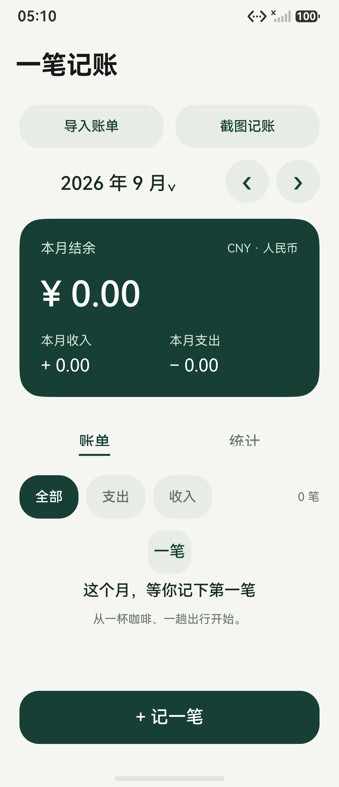
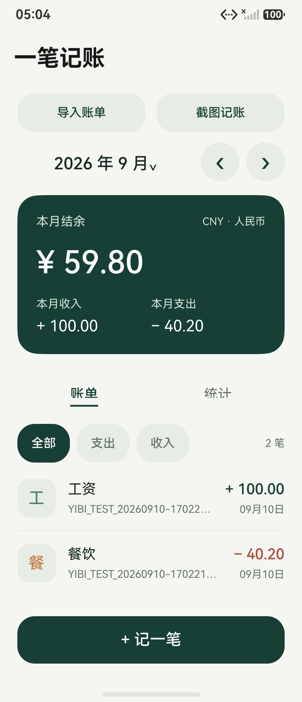
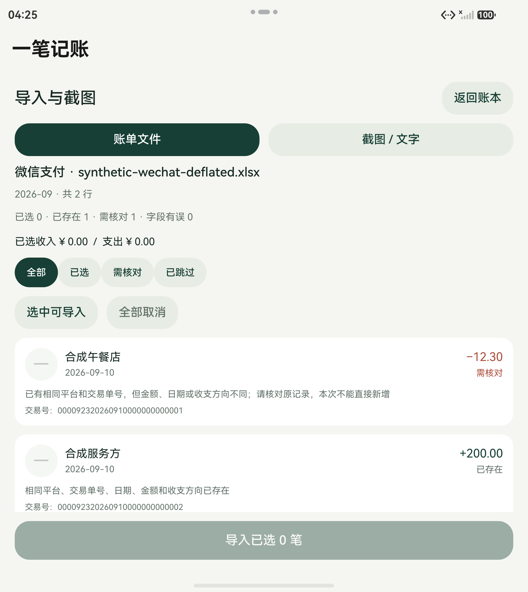
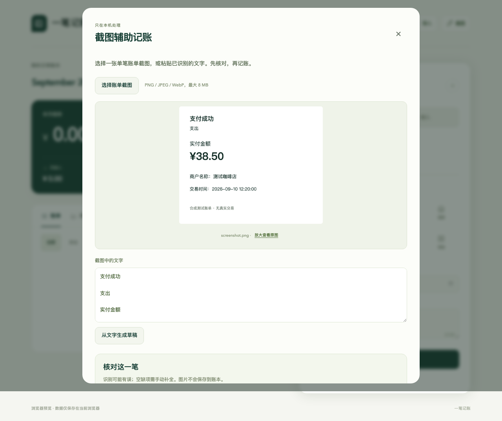

# 一笔记账

面向个人日常使用的 HarmonyOS 本地记账应用，使用 ArkTS + ArkUI。可记录收支、修改账单、按月查看结余和支出分类，并适配窄屏与折叠屏展开布局。

[版本发布](https://github.com/sk-yan/harmonyos-apps/releases/tag/yibi-ledger-v1.1.0-preview.1) · [构建与安装](docs/INSTALL.md) · [改进记录](../../docs/IMPROVEMENTS-1.1.md) · [返回应用目录](../../README.md)

**当前为 `1.1.0-preview.1` 开发预览版，公开下载的 HAP 未签名。** 原生版本为 `1.1.0`，版本码为 `1001000`。模拟器验收使用 HarmonyOS 6.1.0（API 23）、Mate X5 折叠屏模板。另已在 Mate X6（API 24）配置本地调试签名、安装启动，并检查 GBK 文件预览与首次保存；完整真机回归和系统图片 OCR 尚未完成。个人调试签名包不公开分发。

## 功能

- 收入与支出、12 个内置分类、记账日期和备注。
- 月份切换与直接选月、月度收入、支出、结余与支出分类统计。
- 账单修改、确认删除和未保存草稿保护。
- 微信、支付宝 CSV / XLSX 导入，预览、筛选和逐项核对后整批保存。
- 重复记录识别、同号冲突阻断、退款和转账提醒，以及最近一批导入的撤销。
- 截图识别或粘贴文字辅助填写一笔账单，保存前核对金额、日期和收支。
- 可用宽度达到 680vp 时使用账本与录入双栏，窄屏使用底部录入面板。
- 金额按人民币整数分计算，本地保存成功后更新账本；读取损坏数据时暂停写入。

当前没有账号、云同步、自动连接支付账号、预算和数据导出。原生账本存储在应用沙箱中；卸载或清除应用数据会删除账目。浏览器预览使用浏览器本地存储，与原生账本互相独立。

## 导入微信或支付宝账单

1. 在支付平台导出账单明细。外层 ZIP 包先解压，保留 CSV 或 XLSX 的表头和交易单号，不要先用表格软件把长单号转换成数字。
2. 点击「导入账单」，选择文件；也可粘贴含表头的 CSV 或表格文字。支持 UTF-8 / GBK CSV，以及普通未加密 XLSX。每个文件最多 **8 MiB、5,000 笔明细**；不支持旧 XLS、加密文件或含公式的工作表。
3. 检查文件来源、覆盖月份、已选笔数及收支金额。列表每页 30 行，可筛选已选、需核对和已跳过项；默认只选择普通、完整且可导入的交易。
4. 退款、转账、充值、提现、还款、理财和疑似重复项默认不选。只有确认它应按显示的「收入」或「支出」计入时才勾选。**退款不会自动冲减原支出或修正历史净额。** 金额、日期或方向缺失的行需回到原账单核对后手动补记。
5. 确认导入后，应用一次保存整批结果，并跳到本批最新的账单月份。本会话内可「撤销本次导入」：只删除最近一批新增的记录，包括后来编辑过的这些记录，其他手动新增账目保留。

相同平台和有效交易单号是明确重复的依据；还会核对金额、日期、方向及保存的原始交易信息。完全一致的记录自动跳过，包括之前人工确认导入的转账或退款。同号信息变化、退款状态变化或同一文件里的同号冲突会阻止直接新增，提示核对原记录。旧导入记录若缺少完整的状态信息，也会保守地要求核对。

没有交易单号、与手工账目同日同额，或与旧导入信息相似时，只提示「疑似重复」，不会自动删除。分类仅使用明确的平台分类和少量关键词作建议，不确定时归「其他」；导入后仍可编辑。

## 截图辅助记账

点击「截图记账」，从图库或文件选择一笔交易的截图，或粘贴付款详情文字。先核对识别文字，再把结果带入编辑器；这一步不会写入账本，也不会在识别失败或取消时替换原来的手工草稿。替换已有未保存内容前会询问。

金额、日期有歧义时留空，方向不确定时需要手动选择。余额、优惠金额和纯数字订单尾号不会作为可靠的交易金额直接填入。核对勾选后才可保存；当天已有同方向、同金额记录时，还会提醒检查是否已经记过。

原生版使用系统 Core Vision OCR；该能力不支持模拟器，**真实手机图片 OCR 尚未验收**，模拟器可粘贴文字走完整核对流程。浏览器版在本机运行中英文 OCR，脚本与模型从当前预览站点加载，图片不会发送给外部识别服务。浏览器识别结果同样必须人工核对。

## 旧账本兼容

1.1 可直接读取现有 `ledger-v1.json` 账本。导入来源、交易单号和原始比对信息是可选字段；修改账单金额、日期或备注时仍保留导入身份，避免改过账单后再次导入产生重复。

使用导入功能后请避免降级到 1.0。旧版保存账本时会丢失这些新字段，影响之后的重复识别。最近一批导入的撤销记录只保留在当前运行会话，不是长期备份功能。

## 实际界面

<p>
  
  
</p>

<details>
<summary>折叠屏展开后的双栏与统计</summary>


</details>

截图来自实际模拟器，样例为验收用测试账单；测试后已清空。应用默认不附带示例账目。

<details>
<summary>导入冲突核对与浏览器本地 OCR 示例</summary>





第二张是浏览器验收截图，不能代替手机系统 OCR 验收。

</details>

## 运行与检查

以下命令均在**仓库根目录**执行，需要 Node.js 24 或更新版本：

```bash
npm ci
npm run dev --workspace @harmonyos-apps/yibi-ledger
```

浏览器打开终端显示的地址，默认是 `http://127.0.0.1:5186/`。只检查本应用时执行：

```bash
npm test --workspace @harmonyos-apps/yibi-ledger
npm run typecheck --workspace @harmonyos-apps/yibi-ledger
npm run build:preview --workspace @harmonyos-apps/yibi-ledger
```

安装并配置 DevEco 环境后，构建原生包：

```bash
python3 scripts/deveco.py yibi-ledger build --modules entry --build-mode debug
```

工程复制、CLI 配置、模拟器和真机签名步骤见[安装说明](docs/INSTALL.md)。

## 验证状态

1.1 已通过 58 项共享核心/存储/XLSX 测试、8 项构建辅助脚本测试、类型检查和预览构建。浏览器原有 9 组与新增 12 组串联通过，生产静态页面也实际通过 CSV 和中文 OCR 检查。原生基础回归 8 组通过；导入相关 8 项按“文件平台 6 项 + 最终键盘与文字草稿 2 项”分段完成，不表示同一轮完整脚本一次通过。详情见[本次验证记录](docs/verification-1.1-preview.1.json)和[改进记录](../../docs/IMPROVEMENTS-1.1.md)。

1.0 已发布版本的基线记录保留在 [verification-preview.1.json](docs/verification-preview.1.json)。此前完整 CodeLinter 的性能分析器发生内部错误；补充 ESLint 结果不能代表 1.1 全量原生 Lint 通过。存储模拟测试也不能替代真实设备文件系统测试。详见[验证说明](../../docs/VALIDATION.md)。

## 源码结构

```text
AppScope/                         应用信息和图标
entry/src/main/ets/pages/Index.ets 原生界面
entry/src/main/ets/model/Ledger.ts 共享账务核心
entry/src/main/ets/model/BillImport.ts 导入、去重与截图文字草稿
entry/src/main/ets/model/Spreadsheet.ts XLSX 文件解析
entry/src/main/ets/components/     原生导入预览界面
entry/src/main/ets/services/       本机文件选择、解码与系统 OCR
entry/src/main/ets/storage/        原生本地存储
preview/                          浏览器交互预览
tests/                            核心、存储和交互验收
docs/INSTALL.md                    构建、模拟器和真机安装
```
